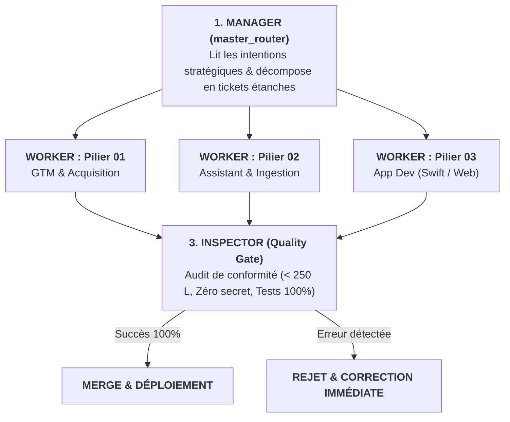

# SQUAD ORCHESTRATOR — MULTI-AGENT COORDINATION STANDARD

Ce skill formalise l'orchestration multi-agents au sein du **Master Plan**, inspirée du moteur `mco-org/squad`.

---

## 🏛️ Les 3 Rôles Fondamentaux du Swarm



---

### 1. Le Rôle `MANAGER` (Tour de Contrôle)
- **Source de Vérité** : [`master_router.md`](file:///c:/Users/HP/Desktop/Master%20Plan/master_router.md).
- **Mission** : Réceptionner la demande utilisateur, identifier le ou les piliers concernés, et émettre des tâches atomiques ne violant jamais la frontière d'un pilier.

### 2. Le Rôle `WORKER` (Spécialistes par Pilier)
- **Worker GTM** : Opère exclusivement dans `01_GTM_Growth/` (zéro modification d'assets iOS).
- **Worker Assistant** : Opère exclusivement dans `02_Assistant_Personnel/` (ingestion, bots Telegram, veille).
- **Worker App Dev** : Opère exclusivement dans `03_Developpement_App/` (SwiftUI, simulateur Web, UI Bento).

### 3. Le Rôle `INSPECTOR` (Garant Inviolable de la Qualité)
- **Règle Absolue** : Zéro validation sans exécution du test déterministe.
- Exécute `node 03_Developpement_App/toolbox/test_code_integrity.js` et `python 01_GTM_Growth/toolbox/test_quality_gates.py`.
- Si un seul fichier dépasse **250 lignes** ou contient des données brutes inlinées, l'Inspector rejette la pull request.

---

## 🛠️ Commandes CLI Rapides

```bash
# Lancer l'inspection automatique (Rôle Inspector)
node 03_Developpement_App/toolbox/squad_bridge.js inspect

# Dispatcher une tâche vers un Worker spécifique
node 03_Developpement_App/toolbox/squad_bridge.js dispatch 03_Developpement_App "Refonte Player Teenage Engineering"
```
