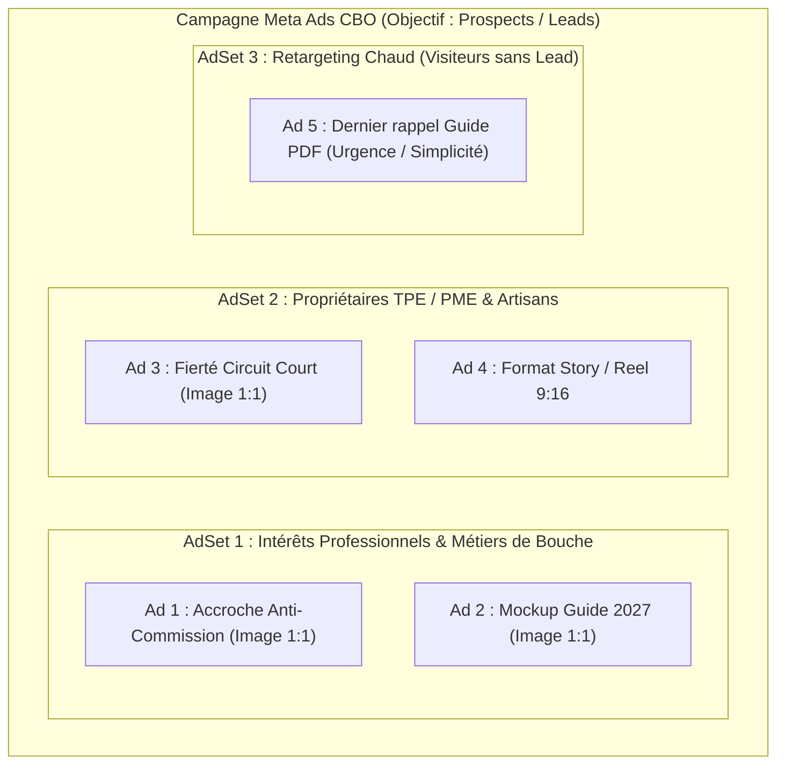

# 🥩 Stratégie d'Acquisition Paid Media & Créatives Meta Ads : 1001 Goûts (Bouchers B2B)

Ce document formalise la stratégie d'acquisition payante (Meta Ads + Google Ads), le plan de taggage **Google Tag Manager (`GTM-N8PN8GB2`)** et les concepts créatifs à haute conversion pour la landing page **1001 Goûts • Espace Pro Bouchers**.

---

## 🎯 1. Cadrage Stratégique & Offre de Conversion

* **Offre Centrale :** Téléchargement gratuit du *« Guide Pratique & Rentabilité 2027 de l'Artisan Boucher »* + Invitation à rejoindre le réseau 1001 Goûts à **0% de commission**.
* **Cible B2B Primaire :** Artisans bouchers-charcutiers indépendants, traiteurs, gérants de boucheries de quartier, marchands itinérants et food trucks bouchers.
* **Problème / Douleur Aiguë (Pain Point) :**
  1. Marges rognées par les intermédiaires et les plateformes de livraison prédatrices (jusqu'à 30% de commission).
  2. Lourdeur administrative et perte de temps sur les registres sanitaires/traçabilité.
  3. Difficulté à capter et fidéliser la nouvelle génération de clients locaux sans budget publicitaire massif.
* **Promesse & Mécanisme Unique :** Vente directe et géolocalisée auprès des consommateurs locaux avec **0% de commission à vie** et boîte à outils d'allègement de gestion.

---

## 📊 2. Architecture de Tracking GA4 / GTM Intégrée

Le conteneur **GTM-N8PN8GB2** est désormais actif sur la landing page avec les événements DataLayer suivants :

| Nom de l'Événement | Déclencheur sur la Page | Paramètres Transmis au DataLayer | Objectif Meta Pixel & GA4 |
| :--- | :--- | :--- | :--- |
| **`page_view`** | Chargement de la page | `page_title`, `url` | Trafic global & Construction d'audiences personnalisées. |
| **`click_cta`** | Clic sur *« Télécharger le Guide Gratuit »* | `cta_name: telecharger_guide_gratuit`, `cta_location: hero / navbar / sticky` | Micro-conversion (Intention de téléchargement). |
| **`scroll_depth`** | Paliers de lecture (25%, 50%, 75%, 90%) | `percent_scrolled`, `page_title` | Qualification de l'attention et du temps passé. |
| **`generate_lead`** | Soumission valide du formulaire de téléchargement | `form_id: guide_boucher_form`, `shop_name`, `postal_code`, `obstacles` | **Événement de Conversion Principal (CPA Cible)**. |

---

## 🎨 3. Propositions de Visuels & Angles Créatifs Meta Ads (Facebook & Instagram)

### 📐 Formats Recommandés :
* **Format Feed :** 1:1 Carré (1080 × 1080 px).
* **Format Stories & Reels :** 9:16 Vertical (1080 × 1920 px).

---

### 🥩 Concept Créatif 1 : L'Angle de Rupture Anti-Commission (Pain Point)

* **Visuel Suggéré :**
  * *Image :* Gros plan authentique sur les mains d'un boucher découpant une belle pièce de viande sur billot en bois avec tablier de travail (ambiance chaleureuse, artisanale, sans filtre artificiel).
  * *Texte incrusté sur l'image (Gros caractères contrastés) :*
    **« 30% de commission sur vos viandes ? C'est terminé. »**
  * *Badge graphique :* Pastille verte : `0% COMMISSION • 100% ARTISAN`.

* **Texte Primaire (Framework PAS - Problème / Agitation / Solution) :**
  > Vous passez 60 heures par semaine debout pour préparer vos découpes et régaler votre quartier… et les plateformes de livraison vous demandent jusqu'à 30% de vos marges ?
  >
  > Chez 1001 Goûts, nous refusons ce modèle.
  >
  > Découvrez comment des dizaines de bouchers indépendants captent une nouvelle clientèle locale en circuit court avec 0€ de commission prélevée sur leurs ventes.
  >
  > 👉 Téléchargez gratuitement le Guide Rentabilité & Circuits Courts 2027 pour votre boucherie.

* **Titre (Max 30 car.) :** `Bouchers : 0% de Commission`
* **Description (Max 90 car.) :** `Le guide gratuit pour booster votre rentabilité locale en 2027.`
* **Bouton CTA :** `En savoir plus` ou `Télécharger`

---

### 📘 Concept Créatif 2 : Le Mockup "Guide Métier & Rentabilité" (Lead Magnet)

* **Visuel Suggéré :**
  * *Image :* Modélisation 3D élégante de la couverture du livre blanc (*« Guide Complet Artisan Boucher 2027 »*) posée à côté d'un couteau de boucher et d'une balance professionnelle sur fond ardoise sombre.
  * *Texte incrusté sur l'image :*
    **« GUIDE GRATUIT 2027 : 5 Leviers pour Maximiser vos Marges Brutes en Boucherie »**
  * *Sous-titre visuel :* `Édition Spéciale Artisans & Traiteurs • PDF Téléchargeable`.

* **Texte Primaire (Framework BAB - Before / After / Bridge) :**
  > Inflation des matières premières, hausses d'énergie, paperasse sanitaire… Tenir une boucherie artisanale n'a jamais été aussi exigeant.
  >
  > Pourtant, certaines boucheries de quartier augmentent leur chiffre d'affaires de +25% en reprenant la main sur leur clientèle locale.
  >
  > Nous avons condensé les 5 stratégies concrètes de rentabilité, de réduction du gaspillage et de commandes directes dans un guide complet de 24 pages.
  >
  > 📥 Téléchargement immédiat et 100% gratuit pour les artisans du métier.

* **Titre (Max 30 car.) :** `Guide Boucher 2027 (Gratuit)`
* **Description (Max 90 car.) :** `Téléchargez le livre blanc officiel dédié aux bouchers artisans.`
* **Bouton CTA :** `Télécharger`

---

### 🛡️ Concept Créatif 3 : La Fierté du Circuit Court (Preuve & Écosystème)

* **Visuel Suggéré :**
  * *Image :* Photo d'un boucher souriant devant sa vitrine achalandée, tenant un panneau ou un macaron : *« Boucherie Partenaire 1001 Goûts »*.
  * *Texte incrusté sur l'image :*
    **« Connectez votre boucherie aux clients de votre ville. Sans intermédiaire. »**

* **Texte Primaire (Framework AIDA - Attention / Intérêt / Désir / Action) :**
  > Les consommateurs recherchent de la viande locale de qualité supérieure. Mais comment vous trouvent-ils quand ils sont sur leur smartphone ?
  >
  > 1001 Goûts référence votre savoir-faire directement auprès des habitants situés dans un rayon de 5 à 15 km autour de votre boutique.
  >
  > ✅ Vos clients commandent en avance au comptoir.
  > ✅ Vous réduisez vos invendus et pertes à 0.
  > ✅ Vous conservez 100% de votre chiffre d'affaires.
  >
  > Cliquez ci-dessous pour recevoir le guide pratique et découvrir les avantages réservés aux professionnels.

* **Titre (Max 30 car.) :** `Vendez Local à 0% Commission`
* **Description (Max 90 car.) :** `Rejoignez les artisans qui digitalisent leur boutique sans frais.`
* **Bouton CTA :** `Obtenir l'offre`

---

## 📈 4. Structure de Campagne Recommandée (Meta Ads CBO)

### 🎯 Paramètres de Ciblage Meta Ads :
* **Localisation :** France entière (ou ciblage départemental/régional si vous déployez par zones géographiques).
* **Âge :** 25 - 62 ans (tranche typique des artisans installés et repreneurs).
* **Intérêts & Données Démographiques :**
  * *Comportements :* Administrateurs de pages d'entreprises locales, Propriétaires de petites entreprises.
  * *Intérêts :* Boucherie, Charcuterie, Viande bovine, Gastronomie française, Circuits courts, Métiers de l'artisanat.
* **Optimisation de la Diffusion :** Événement de conversion standard **`Lead`** (déclenché par notre tag GTM `generate_lead`).

---

## 🔍 5. Stratégie Complémentaire Google Ads (Search Intentionniste)

En parallèle de Meta Ads, capturez les bouchers qui recherchent activement des solutions de gestion et de rentabilité :

* **Mots-clés Exacts & Modifiés :**
  * `[rentabilité boucherie]`
  * `[logiciel boucherie]`
  * `[circuit court boucherie artisanale]`
  * `[comment fidéliser clients boucherie]`
  * `[guide artisan boucher]`
* **Format RSA (Responsive Search Ads) :**
  * *Titres :* `Guide Gratuit Boucher 2027` | `Optimisez Vos Marges en Boucherie` | `0% Commission sur Vos Ventes` | `Circuits Courts pour Artisans`
  * *Descriptions :* `Téléchargez le livre blanc 2027 dédié aux artisans bouchers. Téléchargement immédiat.`
