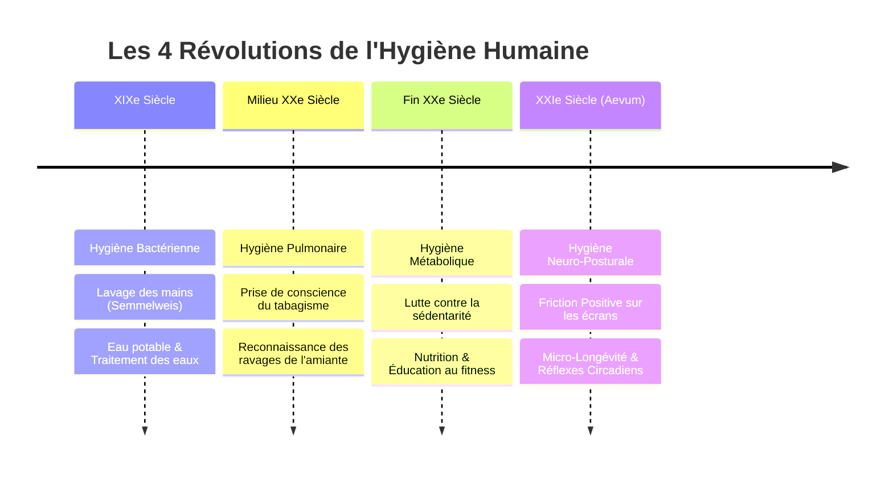
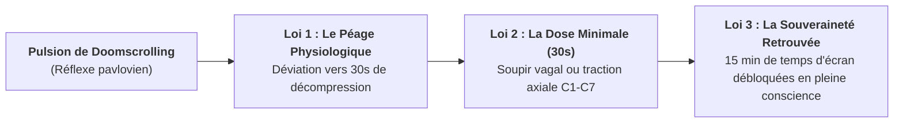

# 🏛️ LE MANIFESTE DES 100 ANS — AEVUM
### *De l'Apnée Numérique à la Longévité Consciente (Édition Évolutive v2.0)*

> *« Il y a 100 ans, les gens buvaient deux litres de vin par jour, fumaient sans connaître les ravages sur leurs poumons et absorbaient des produits toxiques en toute innocence. Aujourd'hui, les outils numériques créent un poison silencieux d'un genre nouveau : l'hypnose passive, l'apnée de l'écran et l'effondrement postural. L'optimisation de la santé de demain passera par ces micro-éléments réappris au quotidien dès le plus jeune âge. »*

---

## ⏳ I. La Frise des 4 Âges de la Santé Publique

Chaque siècle a mené sa bataille pour normaliser une évidence physiologique. L'humanité est aujourd'hui au seuil du 4ᵉ Âge :

---

## 🔬 II. Les 4 Pandémies Silencieuses de l'Écran (Données Cliniques)

Notre époque traite l'épuisement numérique comme une simple "perte de volonté". La science démontre pourtant des dégradations biomécaniques directes et mesurables :

| Pandémie Silencieuse | Mécanisme Physiologique | Impact Mesuré | Source Scientifique |
| :--- | :--- | :--- | :--- |
| **1. L'Apnée de l'Écran** *(Screen Apnea)* | Respiration superficielle ou apnée inconsciente dès l'ouverture d'un flux ou d'un email. | **+40% de Cortisol**, hypoxie cellulaire discrète, activation sympathique chronique. | *Linda Stone / National Institutes of Health (NIH)* |
| **2. Le Text-Neck** *(Syndrome Cervical)* | Flexion de la tête à 60° vers le bas pour regarder un écran portable. | **+27 kg de charge axiale** sur C1-C7 (équivalent d'un enfant de 8 ans sur le cou). | *Dr. Kenneth Hansraj (Surg. Technol. Int., 2014)* |
| **3. Le Gel Ciliaire** *(Hypnose Oculaire)* | Fixation continue d'un rectangle rétroéclairé à 30 cm en vision étroite (*tunnel vision*). | **Chute du clignement de 20 à 5 / min**, dessèchement de cornée, maintien de l'amygdale en alerte. | *Dr. Andrew Huberman (Stanford Neurosciences)* |
| **4. L'Érosion Dopaminergique** | Défilement infini sans point d'arrêt (*Infinite Scroll & Variable Ratio Schedule*). | **Désensibilisation des récepteurs D2**, fatigue décisionnelle, anhédonie numérique. | *B.F. Skinner / Dr. Anna Lembke (Dopamine Nation)* |

---

## ⚖️ III. Les 3 Lois de la Friction Positive Aevum

Face aux bloqueurs d'écran punitifs qui provoquent frustration et contournement, Aevum applique une doctrine inspirée de la neuro-économie et du conditionnement opérant :

1. **Loi du Péage Physiologique (*The Toll Gate*)** : On ne supprime pas une pulsion dopaminergique par la force brute, on la transmute en acte régénérateur pour le corps.
2. **Loi de la Dose Minimale Efficace (*The 30-Second Reset*)** : Trente secondes ciblées suffisent à faire basculer le système nerveux du mode sympathique (stress) au mode parasympathique (récupération).
3. **Loi du Temps Choisi vs Temps Subi** : La fenêtre de grâce de 15 minutes n'est pas une rechute, c'est une session numérique délibérée et souveraine.

---

## 📜 IV. Le Décalogue du Bipède Conscient

Dix axiomes fondateurs à destination de la communauté Aevum, du produit et de la culture :

1. **Ton souffle est ton premier anxiolytique** — Ne le laisse pas en apnée devant une notification.
2. **Ta tête pèse 5 kg** — N'en fais pas une enclume de 30 kg pour un fil algorithmique.
3. **Regarde l'horizon** — Tes yeux n'ont pas évolué pendant trois millions d'années pour s'enfermer dans un rectangle de 6 pouces.
4. **Ton canapé a déposé un avis d'expulsion pour tes fesses** — Bouge avant qu'il n'appelle un huissier.
5. **La dopamine facile d'aujourd'hui est la dette de santé de tes 60 ans.**
6. **L'écran doit être un outil d'expansion, jamais un enclos d'engourdissement.**
7. **La longévité ne se gagne pas à 70 ans dans un hôpital, elle se forge à 30 ans entre deux réunions.**
8. **Chaque respiration profonde est un dividende versé à ton nerf vague.**
9. **Le silence et le vide ne sont pas des bugs, ce sont les sanctuaires de ta créativité.**
10. **Redresse ton squelette : tu es un être debout, pas un mollusque numérique.**

---

## 🧬 V. Healthspan vs Lifespan : L'Objectif Ultime

La médecine du XXe siècle s'est concentrée sur la durée de vie brute (*Lifespan*), créant des années de vieillesse diminuée. 

Aevum se consacre exclusivement à la **durée de vie en pleine possession de ses moyens (*Healthspan*)** :
* Conserver **100% de sa mobilité articulaire et vertébrale à 80 ans**.
* Maintenir une **variabilité de la fréquence cardiaque (HRV) d'élite**.
* Protéger son **acuité visuelle et sa clarté cognitive** contre la neuro-atrophie numérique.

---

*Document vivant — Enrichi au fil des découvertes cliniques et de l'expansion du Master Plan.*
