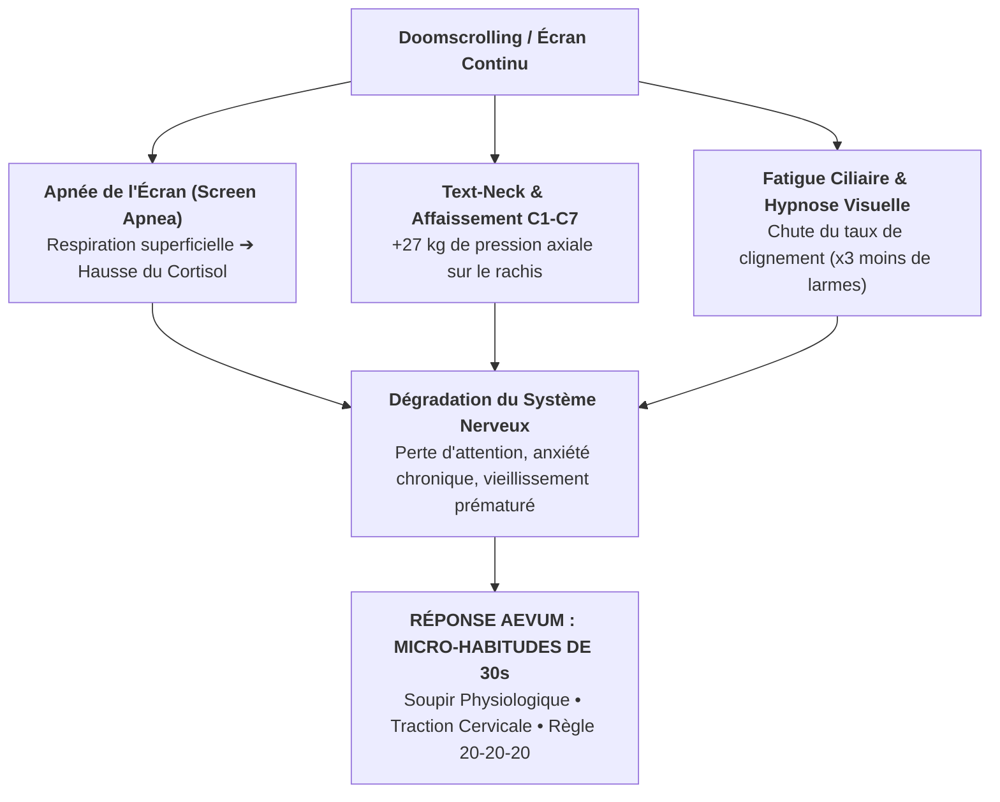

# 🏛️ LE MANIFESTE DES 100 ANS — AEVUM

> *« Il y a 100 ans, les gens buvaient deux litres de vin par jour, fumaient sans connaître les ravages sur leurs poumons et absorbaient des produits toxiques en toute innocence. Aujourd'hui, les outils numériques créent un poison silencieux d'un genre nouveau : l'hypnose passive, l'apnée de l'écran et l'effondrement postural. »*

---

## 🔬 La Thèse Scientifique d'Aevum

Notre époque traite l'épuisement attentionnel et la sédentarité numérique comme des fatalités individuelles. La science démontre pourtant qu'il s'agit de **réactions physiologiques directes et mesurables** :

---

## 🎯 Les 3 Piliers du Changement de Paradigme

### 1. Du Blocage Culpabilisant à la Friction Positive
Les bloqueurs d'écran traditionnels échouent car ils imposent une punition binaire (*"Arrête d'utiliser ton téléphone"*). Aevum propose un **échange physiologique équitable** :
* ➔ *30 secondes de décompression corporelle = 15 minutes de temps d'écran débloquées en pleine conscience.*

### 2. Le Micro-Learning Circadien (Inspiré de Blinkist)
Exactement comme Blinkist a démocratisé la lecture en condensant les livres en unités de 15 minutes, Aevum transforme les protocoles des plus grands laboratoires de neurosciences (*Stanford Medicine, Harvard Medical School, Dr. Kenneth Hansraj*) en **micro-gestes de 30 secondes** actionnables sous le pouce.

### 3. L'Éducation Posturale et Respiratoire dès le Plus Jeune Âge
L'hygiène posturale et respiratoire deviendra dans les 20 prochaines années ce que le brossage de dents est devenu au XXe siècle : **un automatisme non négociable de longévité et de santé publique**.
